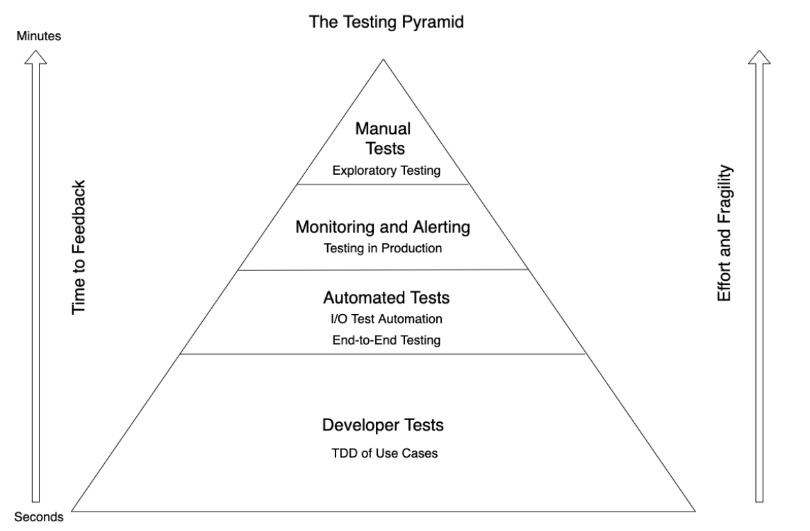

# TDD Revisited - Notes

- Talk by Ian Cooper: https://youtu.be/IN9lftH0cJc?si=GoBXlKVwLQi8jfOb

## Fallacy: Developers write Unit Test

- **Unit Test Definition:** A test which tests a module in isolation. Substitutes such a s method stubs, mock objects, fakes and test harnesses can be used to assist testing a module in isolation. The SUT (System Under Test) must be have every dependency replaced with a test double. This means that modules are tested in isolation, so if a defect occurs, you know it occurs within the module. This idea of unit test comes from automated software testing approaches.
- If you write unit tests as the tests for your TDD it creates problems:
  - You must pre-define how you are partitioning your problem into modules, as you must know where you need to mock. This upfront design can lead to excessive/speculative design not actually required by necessary behaviours.
  - Our tests understand implementation details of the code we are writing (as it knows where mocks are needed). This means if we want to change this high-level organisation, all our code will break.
- **Principle:** Developers write developer tests.
- **Developer Test:** *Developer tests test behaviour of the public API that is exposed to users (the public API that other people depend upon).* If a program's behaviour is stable from an observer's perspective then no developer tests should change. While the modules under test aren't isolated from each other, tests are still isolated from each other (as the running of one test shouldn't effect the other).
  - This means with developer tests you don't mock out dependencies/other modules. The only exception to this is shared fixtures which are generally I/O objects like databases or calls to external HTTP API's. These get mocked for speed and to ensure that each test is independent from each other.

## Fallacy: The trigger for a new test is a new function

- **Principle:** The trigger for a new test is a new behaviour.
- By making tests check behaviours, it makes them easier to understand. This is because you aren't reading some implementation details being tested, but instead a story about how the public API should work.
- This "story" about the API can be written using the "given, when, then" framework.
- TDD isn't a technique for testing, as much as it is a contract-first technique for exploring how an API solves requirements.
- The next test you write in TDD is just the most obvious next step that you can make towards implementing the requirement given by a use case or user story.
- Developer tests specify behaviour. Refactoring is the process of changing the design of code without changing the behaviour. Therefore you do not write new tests when refactoring to clean code, because in refactoring you aren't introducing in any new behaviour.

## Fallacy: Customers write Acceptance Tests

- Acceptance tests are a type of test which test the functionality of a user story. They are written in plain english by the customer, which are then translated into tests by a testing framework like Gherkin.
- Problems:
  - Customers don't participate/care
  - They create a significant maintenance burden on developers.
  - They are nearly always red as they don't turn green until a feature is fully implemented. This means developers don't run the ATDD suite until the end, which makes them useless for catching errors as you go.
- However, if developer tests in TDD define behaviour then acceptance tests which test behaviour (but have this layer of "plain english" abstraction) aren't needed.
- **Principle:** Customers specify Acceptance Criteria
- "Customers illustrate their descriptions with concrete
examples... programmers use these examples to guide their
work... Sometimes (programmers) use the examples directly in their tests... More often…programmers use the examples as a guide, writing a multitude of more focused, programmer-centric tests as they use TDD "

## Fallacy: It doesn't matter if you are test first or test last

- If you test last, you will end up writing code that is not needed by the given requirements (as you won't be working to satisfy a test). This means you are engaging in speculation and will most likely be wrong. This speculation causes you to write code that may not be needed or has to be re-worked.
- **Principle:** Only write production code in response to a test. Only write a test in response to a requirement.
- User requirements can come in the form of user stories or acceptance criteria.
- By testing first it helps us think about design, as we are guided by the behaviour required of the system. It also helps with scope-control as we don't end up with speculative code when we are just focussed on getting a test to pass.

## Fallacy: You want 100% test coverage of your code

- If TDD is followed religiously then it should result in 100% code coverage as you shouldn't write code that isn't in response to a test.
- **Principle:** Not all of code should be driven by TDD.
- TDD is most useful where it can provide fast binary feedback. There are situations where this isn't the best approach though:
  - Creating UI visual outputs
  - Spikes/throwaway code where the spike is how you get feedback on an idea
  - Integration tasks where you are connecting two systems, can produce tests that are slow to run and hard to make independent from each other. Therefore TDD may not be the best way to approach it. Instead test after.
- **New Testing Pyramid:**

## Some further notes
- *These are some supplementary ideas on the talk I have added.*
- What is the public API we should test:
  - For the backend of a website, this can literally be the HTTP API.
  - For a desktop app this could be the facade that the UI access to get information to display to the user. Importantly we don't test the UI because this can lead to test that are tricky to maintain (as UI's often go through extensive change).
